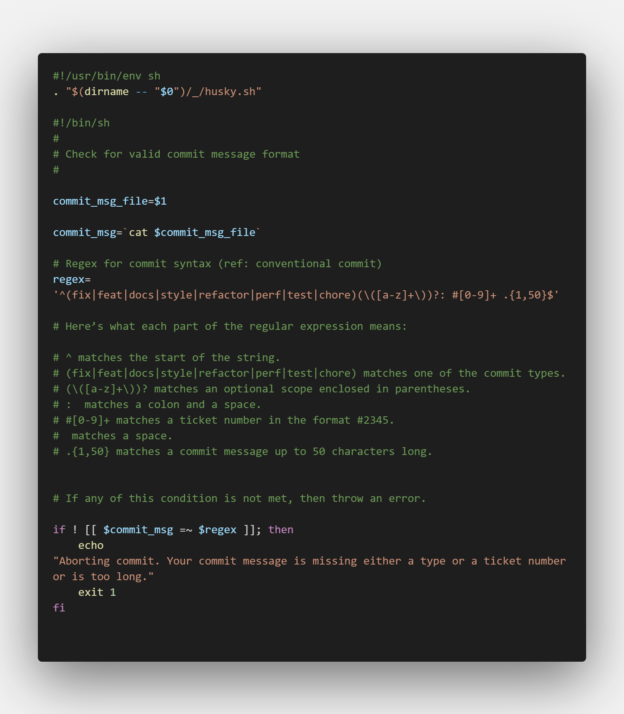

"# learning-angular-github" 

Series of Branches and their corresponding uses:

| Branch Name | Uses |
| --- | --- |
| commit-demo | Demo code to insist code commit using husky (Angular Javascript) |

## Commit Message Example:


The conventional commit recommends the following standard,


## Steps:

1. Install Husky to the project 

``` npx husky-init && npm install ```

2. Add the Commit Message hook to the project using the following command.

``` npx husky add .husky/commit-msg ```

3. The following code has been added to commit file 


4. Checkin all the code and happy commiting 

## Easy reference:

The following commit will works 

``` git commit -m "fix(dashboard): #24345 prevent refresh" ```
``` git commit -m "feat: #3094 added dashbaord loading" ```

The following commits will fails 

``` git commit -m "changes related to dashboard api" ```
